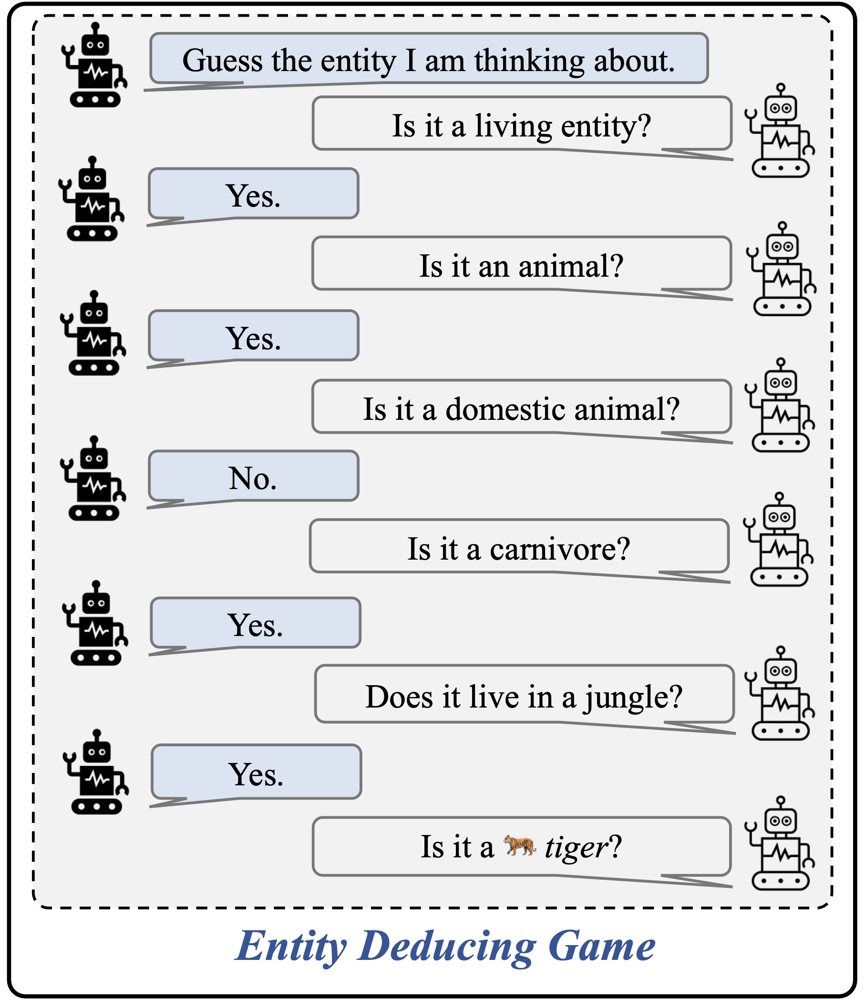

# Entity-Deduction Arena (EDA) 

This software project accompanies the research paper, [Probing the Multi-turn Planning Capabilities of LLMs via 20 Question Games](https://arxiv.org/abs/2310.01468), presented in ACL 2024 main conference. 

# Motivation

- There is a demand to assessing the capability of LLM to **clarify with questions** in order to effectively resolve ambiguities, when confronted with vague queries.
- This capability demands a sophisticated **understanding** of context, **state tracking**, **deductive reasoning**, and **strategic planning** across multiple conversational exchanges.

<p align = "center">

</p>

# Highlights

- The **Entity-Deduction Arena (EDA)** is a surrogate problem that gauges an LLM's aptitude to deduce an entity by posing a series of queries to the judge. 
- Through systematic evaluations, we analyze diverse LLMs and uncover noteworthy disparities in their performance on this particular task.

<div align="center">
    
### Things

| Model        |    #Turns (↓)   | Success (↑) |    #Yes     | Score (↑) |
|--------------|:------------------:|:---------:|:-------------:|:--------:|
| GPT-4-0613        | **17.8±0.2**      | **0.31±0.03** | 5.9±0.1    | **0.26±0.02** |
| GPT-3.5-turbo-0613      | 18.2±0.2      | 0.28±0.02 | 6.3±0.1    | 0.23±0.02 |
| Claude-2     | 18.4±0.3      | 0.21±0.03 | 5.0±0.1    | 0.18±0.03 |
| Claude-1     | 18.8±0.1      | 0.16±0.02 | 4.2±0.1    | 0.13±0.02 |
| [Vicuna 13B (v1.3)](https://huggingface.co/lmsys/vicuna-13b-v1.3)  | 18.4±0.1      | 0.18±0.02 | 5.0±0.2    | 0.15±0.02 |
| [Vicuna 7B (v1.3)](https://huggingface.co/lmsys/vicuna-7b-v1.3)   | 19.5±0.2      | 0.09±0.02 | 5.7±0.2    | 0.07±0.02 |
| [Mistral 7B Inst v0.2](https://huggingface.co/mistralai/Mistral-7B-Instruct-v0.2)   | 18.9±0.1      | 0.13±0.02 | 3.8±0.5    | 0.11±0.02 |

### Celebrities

| Model        |    #Turns (↓)   | Success (↑) |    #Yes     | Score (↑) |
|--------------|:------------------:|:---------:|:-------------:|:--------:|
| GPT-4-0613       | **17.3±0.1**      | **0.50±0.02** | 6.8±0.2    | **0.40±0.02** |
| GPT-3.5-turbo-0613      | 18.8±0.2      | 0.27±0.03 | 7.4±0.2    | 0.21±0.03 |
| Claude-2     | 17.6±0.2      | 0.31±0.02 | 5.6±0.1    | 0.26±0.02 |
| Claude-1     | 17.7±0.2      | 0.29±0.03 | 5.3±0.2    | 0.25±0.02 |
| [Vicuna 13B (v1.3)](https://huggingface.co/lmsys/vicuna-13b-v1.3)    | 18.7±0.2      | 0.22±0.03 | 6.1±0.1    | 0.18±0.02 |
| [Vicuna 7B (v1.3)](https://huggingface.co/lmsys/vicuna-7b-v1.3)    | 19.6±0.3      | 0.06±0.02 | 5.9±0.2    | 0.05±0.02 |
| [Mistral 7B Inst v0.2](https://huggingface.co/mistralai/Mistral-7B-Instruct-v0.2)   | 18.2±0.1      | 0.22±0.04 | 4.3±0.1    | 0.20±0.03 |


</div>


## Install dependencies
```bash
pip install -r requirements.txt
```

## Specify your OpenAI credential (API key)
```bash
export OPENAI_API_KEY="sk-XXXX"
```
## Run the game in commandline

Example usage:
```bash
# GPT3.5 play against GPT3.5 on Things.
python GPT_Q20.py --input data/things/list_of_things_eval.txt -g gpt-3.5-turbo
# GPT4 play against GPT3.5 on Celebs.
python GPT_Q20_celebrity.py --input data/celebrities/list_of_people_eval.txt -g gpt-4
# Vicuna 7b play against GPT3.5 on Things with 5 repetitions.
python GPT_Q20.py --input data/things/list_of_things_eval.txt -g lmsys/vicuna-7b-v1.3 --openai-api False -s hf --num-sessions 5
```
The execution of the above command will create of an output folder named `./data/<model_name>`. This folder contains the game play sessions for all the tested entities. 

### Command-line Arguments:

*Required:*

- `--input`: Specifies the input data to the script.

- `-g, --guesser_model`: Specify the model for guessing. Examples: gpt-4, gpt-3.5, gpt-3.5-turbo, claude-1, claude-2, lmsys/vicuna-7b-v1.3, lmsys/vicuna-13b-v1.3, meta-llama/Llama-2-13b-chat-hf ...

Please note that when using models from the huggingface hub or from a local path, such as lmsys/vicuna-7b-v1.3 or /mnt/ckpts/checkpoint_400 (a local path), you need to set `--openai-api` to `False` in order to load the model correctly. Alternatively, you can set up an openAI API server from the checkpoint as per the instructions provided in the [FastChat repository](https://github.com/lm-sys/FastChat/blob/main/docs/openai_api.md). In this scenario, `--openai-api` should remain `True`.

*Optional:*

- `--answerer_model`: Specify the model for answering questions. Default to GPT-3.5-turbo

- `--suffix`: Optional suffix to modify output or data.

- `--user`: User name for user mode

- `--turns`: Set the maximum number of turns for the game.

- `--temp`: Set the temperature for model sampling.

- `--num-sessions`: Set the number of sessions or iterations.

- `--openai-api`: Whether or not to use OpenAI API server for the guesser model. Default to `True`.


## Batch evaluation
Specify the model as `<your_model>`. If opting for a model path, set `--openai-api` False.
```bash
for rep in 1 2 3 4 5; do
    python script/eval_result.py --dir ./data/<your_model>_rep${rep}
done
```
Then running the following code to compare and summarize all the results across models in the entire folder:
```bash
python script/breakdown_stats.py --dir ./data
```

## Setting a demo server
Coming soon.

## Citation
Please consider citing our work if it is helpful to your research.
```
@inproceedings{zhang2023entity,
  title={Probing the Multi-turn Planning Capabilities of LLMs via 20 Question Games},
  author={Zhang, Yizhe and Lu, Jiarui and Jaitly, Navdeep},
  journal={ACL},
  year={2024}
}
```

## Poster
<p align = "center">

</p>
<p align = "center">
Poster for the entity-deduction arena
</p>
